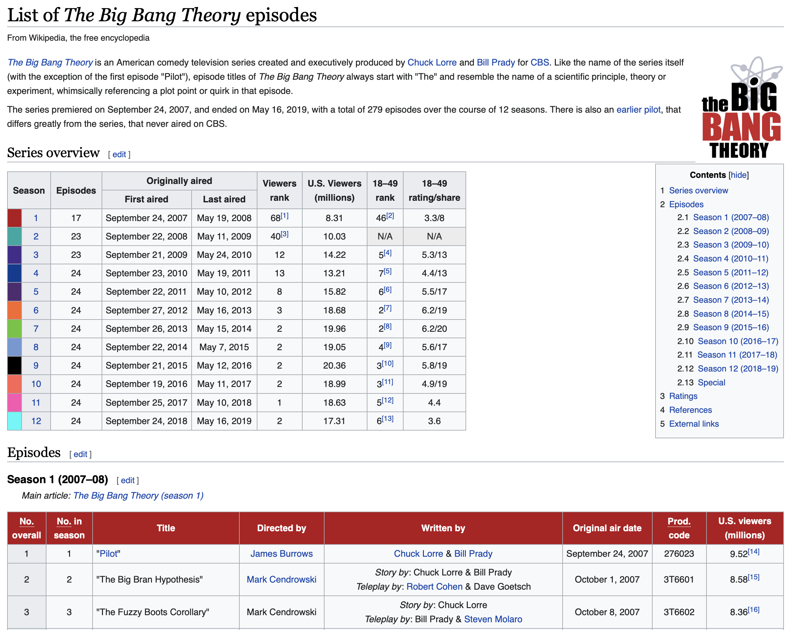

```{r setup, include=FALSE}
knitr::opts_chunk$set(echo = TRUE)
```

There's a lot of information on Wikipedia. Some good, some bad. You're not supposed to cite Wikipedia as a source in papers, but if you instead say "data was scraped from an online encyclopedia" I think that sounds official and science-y enough for most purposes.

This tutorial will be pretty simple. It requires one package, and one line of code to scrape a table from Wikipedia. I've also included a more general scraping solution to capture an arbitrary number of wikipedia tables on TV show viewership as an example.

## The Packages

There's really only one package you need to scrape Wikipedia tables: `htmltab`. I've also added `tidyverse` because I like `dplyr` functions.

```{r}
library(tidyverse)
library(htmltab)
```

## The Data

Suppose I'm interesting in scraping information on viewership of The Big Bang Theory. If you google "big bang theory episodes list", you'll find a [wikipedia page](https://en.wikipedia.org/wiki/List_of_The_Big_Bang_Theory_episodes) that looks a little like this:



## The Code

Scraping tables takes a single line of code. The `htmltab()` function uses two inputs: a link to the webpage, and a number marking which table you want to scrape. In this case, I want to get table #2, which is a summary of Season 1 (table #1 is an index of all seasons).

```{r}
link <- "https://en.wikipedia.org/wiki/List_of_The_Big_Bang_Theory_episodes"

htmltab(link, 2) |>
    glimpse()
```

## The Next Step

What if I don't want to scrape a single table, but multiple tables? Here's one way to do it.

The Big Bang Theory page's first table is an index of all seasons. I can scrape that table, and then use the number of rows (seasons) in that table to scrape each table for each subsequent season, and store the results in a list:

```{r}
link <- "https://en.wikipedia.org/wiki/List_of_The_Big_Bang_Theory_episodes"

## Get list of seasons
index <- htmltab(link, 1)

## Set up storage list
season <- list()

## Scrape each season table
for (i in 1:nrow(index)){
    season[[i]] <- htmltab(link, i + 1)
}

## Example Output
season[[5]] |>
    glimpse()
```

## That's it!

Scraping doesn't need to be scary. Start small, work your way up to more complex tasks. `htmltab` is good for HTML tables that are well-structured on sites like Wikipedia, but more complex scraping projects will probably require a familiarity with packages like `rvest` and `httr`.
